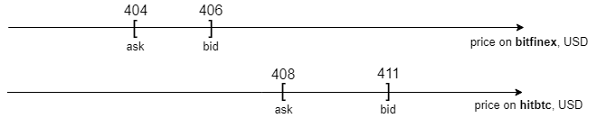

# Стратегия Арбитража

Общий принцип работы Арбитража.
[Инструкция по использованию бота](arbitrage_bot_usage.md)

## Что такое Арбитраж
Говоря простым языком - покупаем в одном месте дешевле,
в другом - продаём дороже.
Естественно, так можно сделать не всегда.
Нужно определённое состояние цен в этих двух местах, чтобы это стало возможным.
Такое состояние цен называется *Арбитражное окно*.

В нашем случае бот и покупает и продаёт криптовалюту на одной и той же бирже.
Информация об арбитражных окнах нужна боту только для того, чтобы предсказать
в какую сторону пойдут цены на биржах.

## Арбитражное окно на примере

Арбитражное окно - это такое состояние цен для пары валют (ETCUSD, например),
при котором на одной бирже цена покупки (ask) этой валюты дешевле,
чем цена продажи (bid) на другой.
В одном окне может быть только одна валютная пара и ровно две биржи,
на которых эта валютная пара торгуется.

Посмотрим на арбитражное окно на примере.

### Окно закрыто
Посмотрим на вымышленную цену валюты ETC на диаграмме.

Диапазоны цен пересекаются, значит окно закрыто.

### Окно открыто

Диапазоны цен не пересекаются, значит окно открыто.

Большинство времени окна находятся в закрытом состоянии.
Это естественное состояние рынка.
При колебаниях окна ненадолго открываются.
В этот момент должен отработать бот.

## Алгоритм арбитража
1. Отслеживаем все цены всех валют на всех подключенных биржах.
1. Видим, что для пары валют ETCUSD открыто арбитражное окно.
1. Заходим (делаем enter): идём на биржу, где ETC дешевле.
Покупаем все предложенные биржей ETC на USD.
Потом идём на биржу, где ETC дороже. И продаём все запрашиваемые биржей ETC за USD.
Этот шаг назваем "разместить *прямые ордеры*" (place *direct orders*).
1. Сохраняем пару прямых ордеров для отслеживания.
ETCUSD - валютная пара для сохранённой пары наших прямых ордеров.
Ждём закрытия окна для ETCUSD.
1. Выходим (делаем exit): для этого вычисляем пару *реверс ордеров*.
Это пара ордеров, обратная паре прямых.
Реверс происходит так:
прямой ордер с покупкой ETC становится ордером с продажей ETC,
и для прямого ордера с продажей ETC - симметрично.
1. На выходе получаем суммарную прибыль на счётах USD для двух бирж, где обработали окно.
"Суммарную", на одном из счетов USD мы можем увидеть убыток,
но он компенсируется прибылью на другом счёте USD.

## Преимущества алгоритма
1. Защита от рисков. Мы делаем только *short sells* для криптовалют.
Это значит, что мы получим прибыль от Арбитража при любых колебаниях валюты.
1. Надёжность операций. Мы не пересылаем деньги между биржами.
Все операции buy/sell делаем внутри бирж.
Избавляемся от проблем со скоростью операций и накладных расходов.
