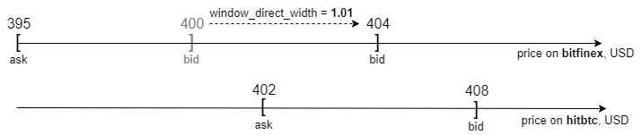

# Использование бота для Арбитража
Перед тем как читать эту инструкцию,
рекомендуем прочитать [нашу интерпретацию стратегии Арбитража](arbitrage.md).

## Установка
Установка описана [в readme-файле в разделе Beginner's guide](../../README.md#begginers-guide).
Это инструкция для Прогера или Админа.

## Настройка
Стандартные настройки можно найти в файле [test.yml](../../README.md#begginers-guide).

Большинство настроек описаны в комментариях конфиг-файла.
Многие из них интуитивно понятны. 
Подробно разберём только эти:
- max_spend_part
- window_direct_with
- window_reversed_width

### max_spend_part
Процент денег на счёте, которые бот может использовать в Арбитраже для оборота.
Посмотрим на примере.
- Пусть у бота в рамках Арбитража есть офер покупки 1 ETC за 1000 USD на hitbtc;
- у бота на USD-счету биржи hitbtc 100 USD;
- тогда при `max_spend_part=0.8` бот сможет купить 0.08 ETC за 80 USD;
- до закрытия окна и выхода из Арбитража на счету останется 20 USD;
- в это время бот может использовать `0.8*20 USD` для оборота другого окна.

Не рекомендуем выставлять `max_spend_part=1.0`.
Могут возникнуть ошибки типа "недостаточно средств"
из-за комиссий бирж и вычислительных погрешностей при подсчёте суммы сделки Арбитража.

### window_direct_width
Действует только для проверки ширины окна
при размещении *прямых ордеров*. То есть при входе в Арбитраж.

Этот конфиг двигает левую границу окна (ask) влево-вправо.
Это позволяет нам увеличивать/уменьшать размер окна.

На рисунке видим результат применения window_direct_width.
Мы уменьшили ширину окна и оно закрылось.
 
### window_reverse_width
Такой же функционал, как у `window_direct_width`.
Но действует только для проверки ширины окна
при размещении *реверс-ордеров*. То есть при выходе из Арбитража.

## Как использовать ширину окна
Посмотрим на возможности, которые даёт нам ширина окна.
- `window_reverse_width - window_direct_width` - 
это процент гарантированной прибыли для Арбитража.
Бот не будет обрабатывать окна с меньшей прибылью.
- Прибыль из предыдущего пункта может быть и отрицательной,
если `reverse_width < direct_width`.
С такими настройками бот будет находить *отрицательные окна*.
Они полезны для ручного теста бота.
Положительные окна можно найти не в любой момент времени.
А отрицательные есть почти всегда. 
- В некоторых случаях Арбитражное окно может быть одновременно
готовым для входа - открытым. И готовым для выхода - закрытым.
Это нормальное поведение.
